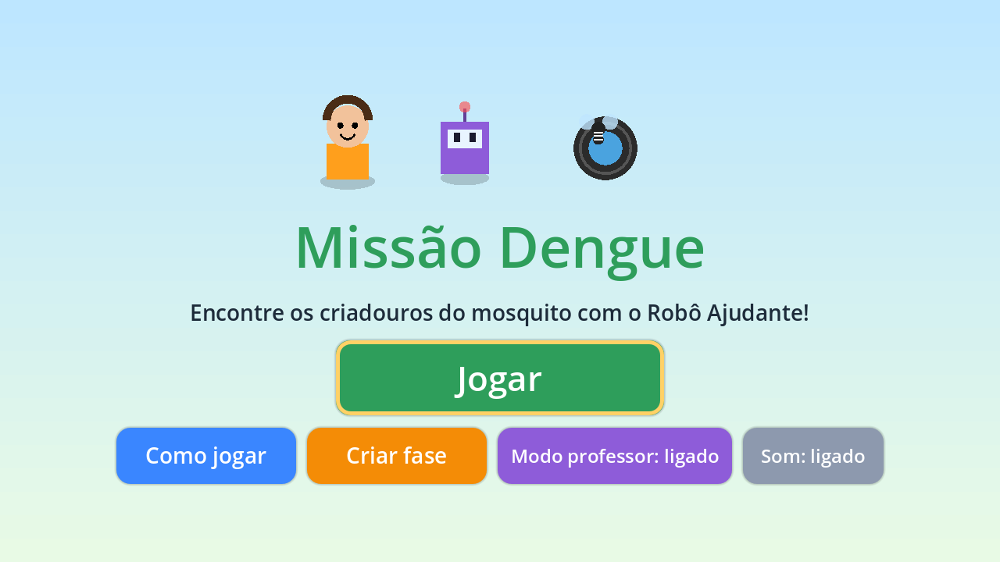
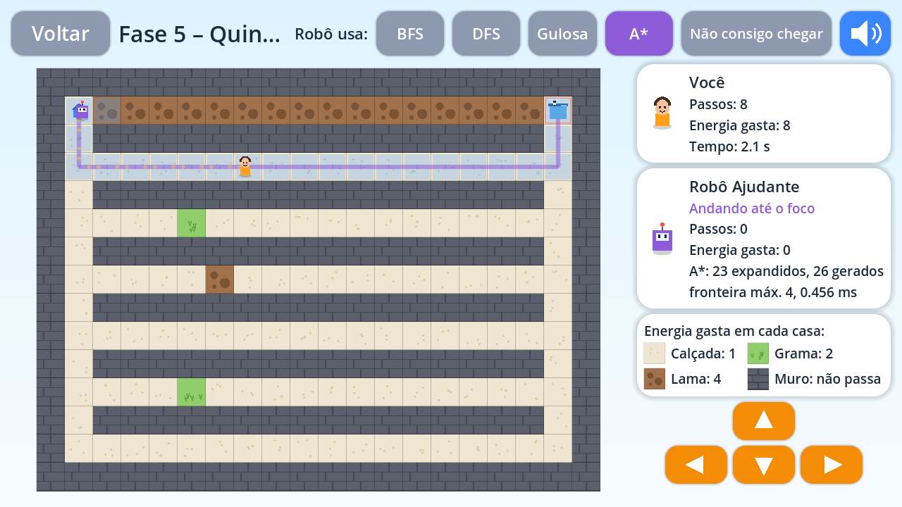
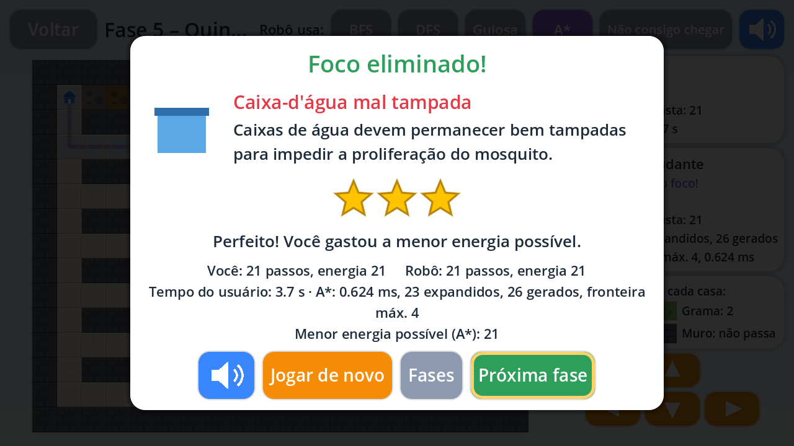
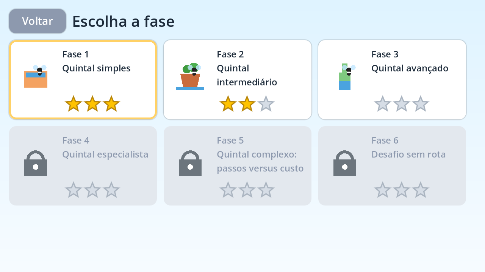
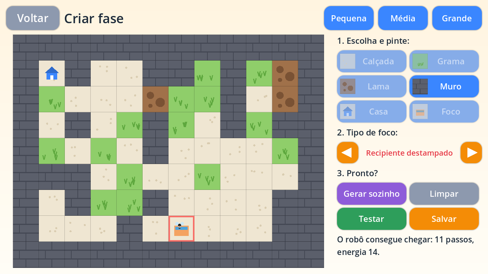

# Missão Dengue — jogo educativo (bônus, Godot 4.5+)

Versão jogável do ambiente de simulação, pensada para **crianças do Ensino Fundamental e
alunos com deficiência intelectual** (item 2.11 do enunciado). A criança e o **Robô Ajudante**
procuram o mesmo foco de dengue no mesmo mapa: primeiro a criança faz o seu caminho e só
depois o robô procura, para que ela não copie a rota dele. Ao chegar, o jogo mostra o
criadouro encontrado e uma orientação de prevenção.



## Como abrir e jogar

1. Instale a [Godot 4.5 ou mais recente](https://godotengine.org/download) (versão padrão, sem .NET). Testado na 4.5.1 e na 4.7.1.
2. Na Godot, clique em **Importar**, escolha `bonus_godot/project.godot` e depois **Executar** (F5).

Pelo terminal: `godot --path bonus_godot`.

| Ação | Como fazer |
|---|---|
| Andar | setas ou WASD, os botões laranja da tela, ou tocar/clicar na casa ao lado |
| Ouvir as instruções e a mensagem educativa | botão azul com alto-falante |
| Desistir (fase sem rota) | botão "Não consigo chegar" |
| Pular a vez do robô | botão "Ver resultado" (aparece no lugar de "Não consigo chegar") |

## O que o jogo tem

- **6 fases**: os mesmos mapas de `scenarios/` (copiados em `levels/`), liberadas em sequência. Cada uma
  representa um criadouro: recipiente destampado, vaso, garrafa, pneu, caixa-d'água e balde.
- **Energia em vez de "custo"**: calçada gasta 1, grama 2 e lama 4, com legenda sempre visível.
  As estrelas comparam a energia gasta com a menor possível (calculada pelo A\*):
  3 estrelas no ótimo, 2 até 50% acima, 1 acima disso.
- **Robô Ajudante**: joga depois que a criança chega ao foco (ou desiste). Primeiro "pensa",
  mostrando em azul as casas que a busca expandiu, e depois anda pelo caminho encontrado
  (linha roxa). As pegadas da criança continuam no mapa para comparar os dois caminhos.
  A vez do robô dura no máximo uns 5 segundos em qualquer mapa.
- **Cartão educativo** no final, com o desenho do criadouro, a orientação de prevenção,
  a comparação criança × robô e leitura em voz alta.
- **Fase sem rota**: ensina que, quando não dá para chegar, é preciso pedir ajuda a um adulto.
- **Modo professor** (tela inicial): libera todas as fases, permite trocar o algoritmo do robô
  (BFS, DFS, Gulosa, A\*) e mostra estados expandidos, gerados, fronteira máxima e tempo.
- **Editor de fases**: pintar calçada, grama, lama e muro; posicionar casa e foco; escolher o
  criadouro; **gerar um mapa automaticamente** (só aceita mapas com caminho); testar e salvar.
  As fases salvas aparecem em "Minhas fases".

| Jogando (modo professor) | Resultado |
|---|---|
|  |  |
| **Fases** | **Editor** |
|  |  |

### Decisões de acessibilidade

- Letras grandes (19 a 72 px), botões grandes com cantos arredondados e cores fortes com bom contraste.
- Uma instrução por vez, com frases curtas, e botão para ouvir tudo em voz alta. As falas usam
  gravações (voz humana ou neural) em `audio/voz/`; sem elas, a voz do sistema. Veja
  [audio/README.md](audio/README.md) para gravar ou gerar as vozes.
- Várias formas de jogar: teclado, mouse ou toque, sem depender de destreza.
- Sem limite de tempo para a criança. O tempo só aparece no modo professor.
- Retorno imediato: som e tremida ao bater no muro, som a cada passo, confete e som ao eliminar o foco.
- Linguagem positiva nas mensagens de resultado ("Você conseguiu! Tente de novo gastando menos energia").
- Nenhum arquivo externo de imagem ou efeito sonoro: tudo é desenhado e sintetizado pelo jogo, o
  que deixa o projeto leve e fácil de exportar. Só as falas usam arquivos de áudio.

## Algoritmos autorais

`scripts/search.gd` reimplementa à mão BFS, DFS, Busca Gulosa e A\*, com a heurística
Manhattan × menor custo. **Não usa `AStarGrid2D`, `AStar2D` nem `NavigationServer`.** A lógica é a
mesma de `src/dengue_agent/search/`: mesma ordem de sucessores, mesmo desempate por ordem de
inserção, mesmo teste de objetivo e mesmas contagens. O heap binário da fila de prioridade também
foi escrito à mão.

`tests/test_godot.py`, na raiz do repositório, confere que:

- `levels/` é idêntico a `scenarios/`;
- as buscas em GDScript dão **exatamente** o mesmo caminho, passos, custo, estados expandidos,
  estados gerados e fronteira máxima que as buscas em Python, nos 6 mapas e nos 4 algoritmos;
- o jogo responde ao teclado, cobra a energia certa e dá as estrelas corretas (`tests/smoke_test.gd`).

```bash
GODOT_BIN=/caminho/para/godot uv run pytest tests/test_godot.py
```

Sem `GODOT_BIN`, só o teste dos níveis roda e os outros são pulados.

## Exportar (Web, Windows, Linux)

Os presets já estão em `export_presets.cfg`.

1. Na Godot: **Editor > Gerenciar modelos de exportação > Baixar e instalar**.
2. **Projeto > Exportar**, escolha Web, Windows ou Linux e clique em **Exportar projeto**.
   A saída vai para `bonus_godot/export/`, que o git ignora.

A versão Web (`export/web/index.html`) precisa ser servida por HTTP; abrir o arquivo direto no
navegador não funciona. É a opção indicada para publicar no site do LESIC. Para testar localmente:
`python -m http.server --directory bonus_godot/export/web`.

## Estrutura

```text
bonus_godot/
  project.godot, export_presets.cfg, icon.svg
  scenes/main.tscn          cena única; as telas são montadas por código
  levels/*.json             cópia de scenarios/
  scripts/
    grid_problem.gd         grade, custos e sucessores (igual a grid.py)
    search.gd               BFS, DFS, Gulosa e A* autorais
    main.gd                 navegação: início, como jogar, fases, jogo e editor
    game_screen.gd          missão: jogador × robô, cartão educativo e estrelas
    editor_screen.gd        editor e gerador de fases
    board.gd, art.gd        desenho do tabuleiro, personagens e criadouros
    ui.gd, sfx.gd           componentes de interface e sons sintetizados
    progress.gd             estrelas e fases salvas
    voz.gd                  classe Voz: toca as gravações ou usa a voz do sistema
  audio/frases.json         textos falados (e exibidos) no jogo
  audio/voz/                gravações das falas (ver audio/README.md)
  audio/gerar_vozes.py      gera as falas com voz neural ou lista o roteiro de gravação
  tests/                    comparação com o Python, teste de fumaça e capturas de tela
```
