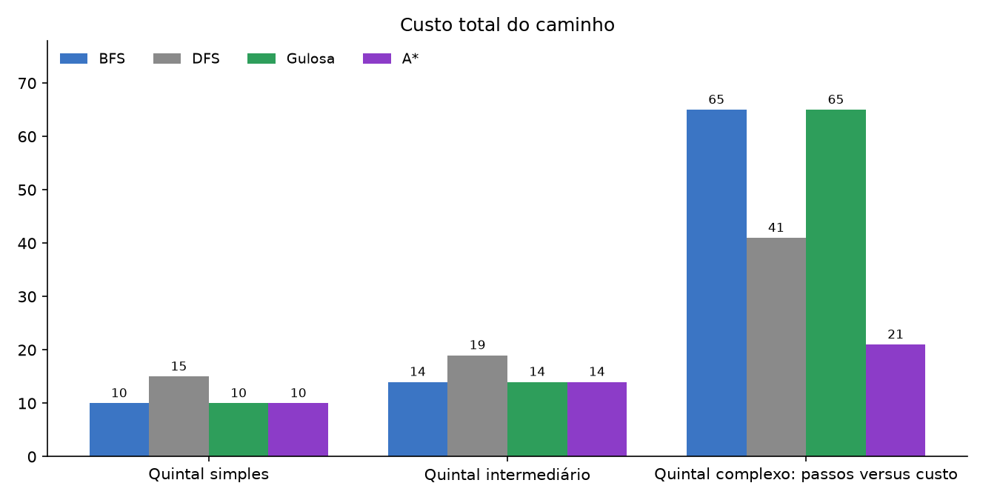
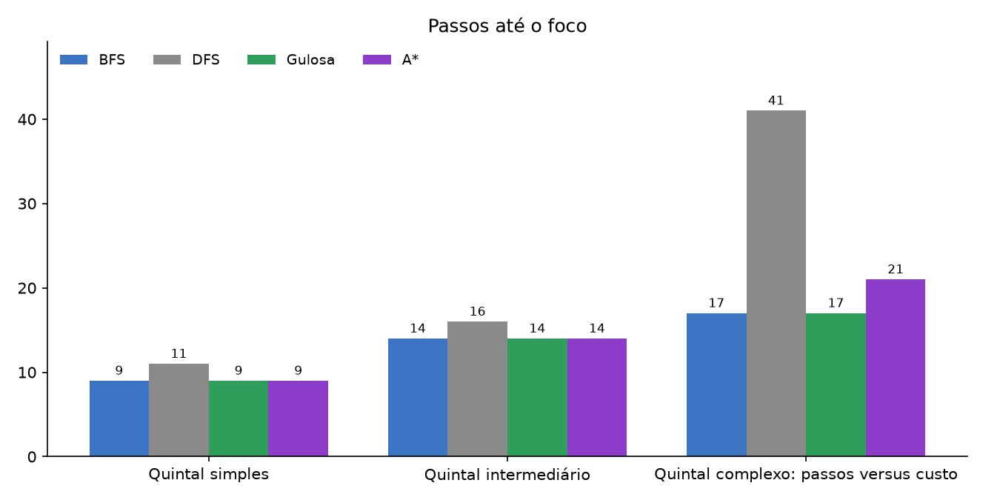
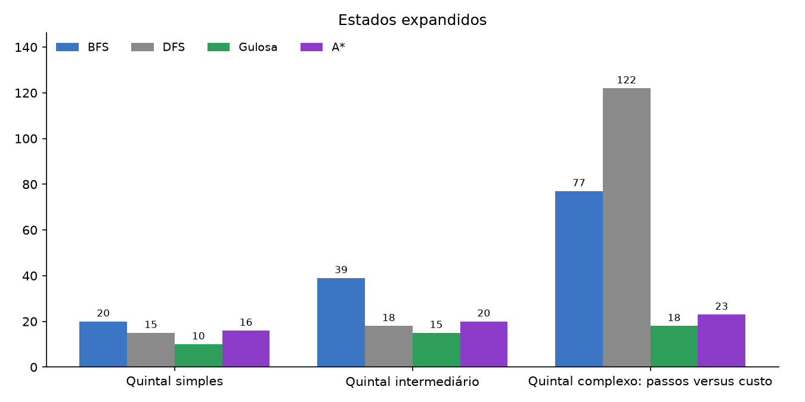
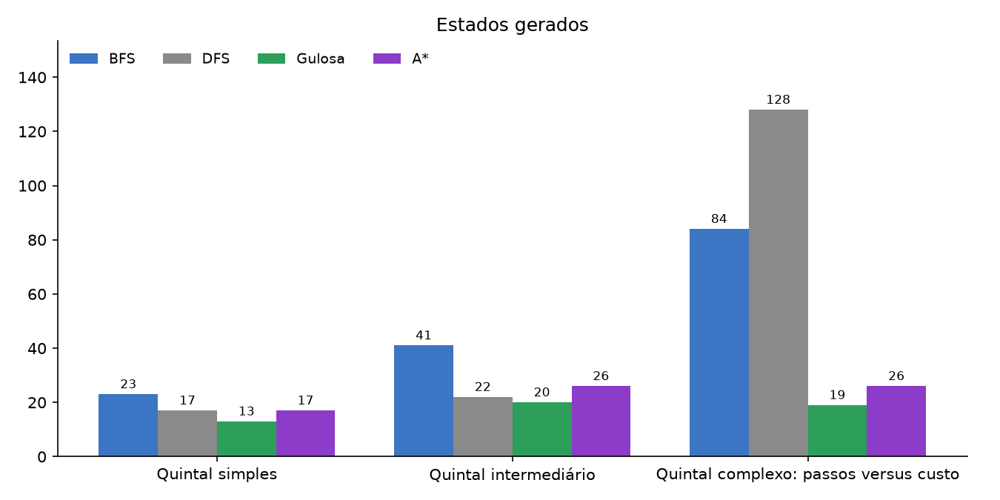
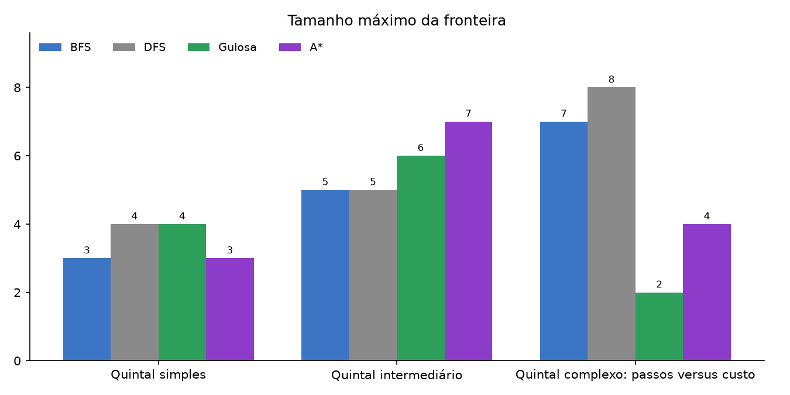
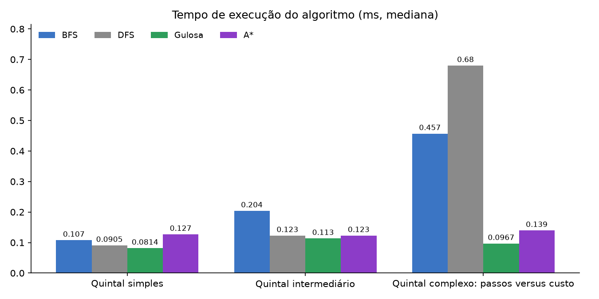
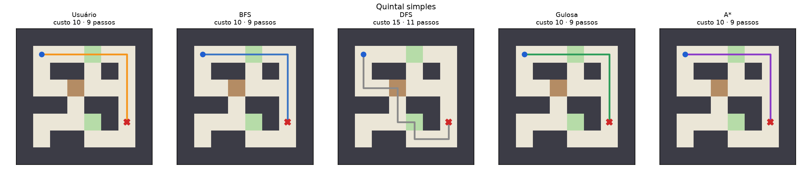
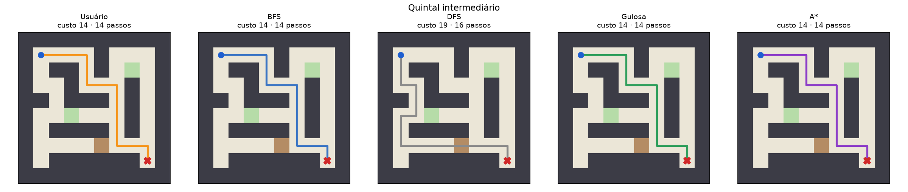
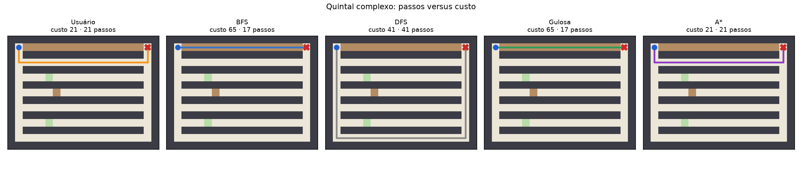

# Relatório Técnico — Agente de Combate à Dengue

> Versão de trabalho em Markdown. A versão entregue no Moodle deve ser transposta para o
> modelo de trabalhos acadêmicos da UTFPR (capa, folha de rosto, sumário, listas de
> figuras e tabelas).

## 1. Introdução

A dengue é uma doença transmitida pelo mosquito *Aedes aegypti*, cuja reprodução depende
de água parada em recipientes como pneus, vasos de plantas, garrafas, baldes e caixas-d'água
mal tampadas. Eliminar esses criadouros é a principal medida de prevenção ao alcance da
população (BRASIL, 2024; WORLD HEALTH ORGANIZATION, 2024).

Este projeto transforma essa tarefa em um problema de busca: um quintal é representado
como uma grade bidimensional, com obstáculos e terrenos de custos diferentes, e é preciso
sair de uma posição inicial e chegar a um foco de dengue. Dois participantes resolvem a
mesma instância: um **usuário**, que controla o personagem pelo teclado, e um **agente
inteligente**, que planeja o trajeto com um dos quatro algoritmos implementados pela equipe:

- Busca em Largura (BFS) e Busca em Profundidade (DFS), estratégias sem informação;
- Busca Gulosa, que ordena a fronteira apenas pela heurística, `f(n) = h(n)`;
- A\*, que combina custo percorrido e estimativa, `f(n) = g(n) + h(n)`.

Representar o problema como um espaço de estados permite aplicar os mesmos algoritmos a
qualquer mapa sem alterar o código, e medir objetivamente o esforço de cada estratégia
(estados expandidos, estados gerados, tamanho da fronteira e tempo). A comparação com o
usuário mostra onde a intuição humana coincide com uma busca sistemática e onde ela falha,
principalmente quando o caminho visualmente mais curto não é o mais barato (RUSSELL;
NORVIG, 2022).

O sistema foi escrito em Python 3.11 com a biblioteca gráfica Arcade. Os algoritmos de
busca são autorais: da biblioteca padrão foram usados apenas contêineres genéricos
(`list`, `set`, `dict`, `collections.deque` e `heapq`).

## 2. Modelagem do Problema

### 2.1 Matriz e tipos de célula

O ambiente é uma matriz bidimensional lida de um arquivo JSON (`scenarios/*.json`). Cada
caractere da grade vira uma célula:

| Símbolo | Tipo (`CellType`) | Custo para entrar | Significado no cenário |
|---|---|---:|---|
| `.` | `FREE` | 1 | calçada / caminho livre |
| `G` | `GRASS` | 2 | grama |
| `D` | `DIFFICULT` | 4 | terreno de difícil acesso (entulho, lama) |
| `#` | `OBSTACLE` | — | muro, móvel, parede: não pode ser atravessado |
| `S` | `FREE` | 1 | posição inicial da missão |
| `F` | `FREE` | 1 | foco de dengue (objetivo) |

Os custos seguem a sugestão do enunciado. São positivos e mantêm proporção com o esforço
real: andar na grama custa o dobro da calçada, e atravessar terreno difícil custa o
quádruplo. O custo pertence à **célula de destino** do movimento. Assim, o custo de um
caminho é a soma dos custos das células em que se entra, sem contar a célula inicial.

Cada arquivo JSON contém nome, tipo de foco (`focus`), mensagem educativa (`message`) e a
grade. Ao carregar o arquivo, `S` e `F` tornam-se posições (`Position(row, col)`) e os
símbolos da grade tornam-se tipos de célula. O carregador (`scenarios.py`) rejeita linhas
de tamanhos diferentes, símbolos desconhecidos e mapas sem `S` ou `F`. As dimensões dos
cenários vão de 8×8 a 15×20 (ver Seção 7.1).

### 2.2 Grafo implícito e formulação do problema de busca

Cada célula transitável é um nó de um grafo implícito. As arestas ligam células vizinhas
na horizontal ou na vertical, e o peso de cada aresta é o custo da célula de destino. O
grafo nunca é construído por inteiro: os vizinhos são gerados sob demanda pela função
sucessora. A classe `GridProblem` (`grid.py`) concentra a formulação:

- **Estados:** todas as posições `(linha, coluna)` dentro da matriz que não são obstáculo.
- **Estado inicial:** `initial_state`, a posição de `S`. É o mesmo para o usuário e o agente.
- **Ações:** mover para cima, direita, baixo ou esquerda (`MOVES`, nessa ordem fixa).
- **Função sucessora:** `successors(pos)` devolve os pares `(vizinho, custo)` das ações
  válidas, isto é, que não saem da matriz nem entram em obstáculo (`is_valid`).
- **Teste de objetivo:** `is_goal(pos)` verifica se a posição é a do foco `F`.
- **Custo do caminho:** soma de `cost(pos)` das células percorridas, ou seja, `g(n)`.

A ordem fixa das ações torna BFS e DFS reproduzíveis: com a mesma entrada, a busca sempre
devolve o mesmo caminho e as mesmas métricas, o que é necessário para os experimentos e
para a demonstração. As buscas, a interface e o jogador humano usam o mesmo `GridProblem`,
então as regras de movimento existem em um único lugar.

## 3. Desenvolvimento e Funcionamento do Ambiente

### 3.1 Arquitetura

```text
scenarios/*.json  →  scenarios.py (Scenario)  →  grid.py (GridProblem)
                                                     ├─ search/ (BFS, DFS, Gulosa, A*) → SearchResult
                                                     ├─ player.py  (usuário: caminho, passos, custo, tempo)
                                                     └─ agent.py   (animação do SearchResult)
ui/app.py (Arcade): desenha o estado e lê o teclado
experiments.py: executa as 15 execuções e gera tabelas/gráficos
```

A interface não contém regras do problema. Ela apenas desenha o estado atual e repassa as
teclas ao `Player` ou ao `AgentRun`. Por isso, `Player` e `AgentRun` são testados sem abrir
janela (`tests/test_player.py` e `tests/test_agent.py`).

### 3.2 Definição da missão

Ao abrir o jogo (`uv run dengue`), o primeiro cenário é carregado. As teclas `1` a `6`
trocam de cenário, e `TAB` escolhe o algoritmo do agente (BFS, DFS, Gulosa ou A\*; o
padrão é A\*). Origem e foco vêm do arquivo JSON do cenário e alimentam um único
`GridProblem`, compartilhado pelo usuário e pelo agente. Isso garante que os dois resolvam
exatamente a mesma instância: mesmo mapa, mesma origem e mesmo objetivo.

### 3.3 Usuário

O usuário se move com as setas ou WASD. Segurar a tecla repete o passo depois de um breve
atraso. A cada tecla, `Player.move` pede ao `GridProblem` para validar a posição. Movimentos
para fora da grade ou contra obstáculos são ignorados e não contam passo, custo nem tempo.
Cada movimento válido:

- atualiza a posição e acrescenta a célula ao caminho percorrido;
- soma o custo do terreno de destino;
- incrementa o número de passos.

O cronômetro começa no primeiro movimento válido e para ao alcançar o foco. A tecla `X`
permite desistir quando o foco é inalcançável (cenário "Desafio sem rota"), e `R` reinicia
a missão. Quando o usuário termina, a partida é gravada como uma linha de
`results/human_runs.jsonl`, com cenário, caminho, passos, custo, tempo e se chegou ao foco.

### 3.4 Agente inteligente

A tecla `ESPAÇO` inicia o agente. A busca selecionada roda **inteira** antes de qualquer
desenho e mede o próprio tempo com `time.perf_counter()`. O tempo informado é, portanto,
só o do algoritmo, sem a animação. O `SearchResult` é então entregue ao `AgentRun`, que
reproduz a execução em duas fases:

1. revela os estados expandidos na ordem em que foram visitados (`explored_order`), com uma
   camada azul translúcida, a um estado a cada 0,03 s;
2. mostra o caminho final em roxo e move o agente por ele, uma célula a cada 0,12 s.

### 3.5 Visualização e sincronização

Usuário e agente dividem a mesma grade. Os terrenos têm cores próprias: bege para livre,
verde para grama, marrom para terreno difícil e cinza-escuro para obstáculo. A origem é um
círculo azul, o foco um círculo vermelho, o agente um círculo roxo e o usuário um círculo
laranja menor, desenhado por cima, para que ambos fiquem visíveis na mesma célula. O
rastro do usuário aparece em amarelo translúcido. O cabeçalho mostra em tempo real passos,
custo e tempo do usuário, além das métricas do agente.

Usuário e agente podem atuar ao mesmo tempo. A missão só termina quando **os dois**
concluem: o usuário chega ou desiste, e o agente termina a animação. Nesse momento aparece
um painel com o foco encontrado, a mensagem educativa e a tabela comparativa
(passos, custo, tempo, estados expandidos, estados gerados e fronteira máxima).

## 4. Implementação dos Algoritmos

Os quatro algoritmos operam sobre o mesmo `GridProblem` e compartilham três componentes
de `search/common.py`:

- **`Node`**: guarda a posição, o nó pai, o custo acumulado `g(n)` e a profundidade.
- **`SearchResult`**: retorno padronizado com caminho, custo, passos, estados expandidos,
  estados gerados, tamanho máximo da fronteira, tempo de execução em ms e `explored_order`
  (sequência de posições expandidas, usada na animação).
- **`reconstruct_path(node)`**: sobe pela cadeia de pais a partir do nó objetivo até a raiz
  e inverte a lista, obtendo o caminho da origem ao foco.

Definições das métricas: um estado é **gerado** quando um nó é criado e inserido na
fronteira (a raiz conta como gerada). Um estado é **expandido** quando é retirado da
fronteira para ter seus sucessores gerados. A **fronteira máxima** é o maior tamanho que a
fila, pilha ou heap atingiu durante a execução.

### 4.1 Busca em Largura (BFS)

- **Fronteira:** fila FIFO (`collections.deque`).
- **Estados visitados:** o conjunto `reached` recebe cada posição no momento da **geração**,
  o que impede que a mesma célula entre duas vezes na fila.
- **Teste de objetivo:** na geração. Como a BFS avança por níveis, o primeiro filho que é
  objetivo está na menor profundidade possível. Assim, a BFS é ótima em número de passos,
  mas não em custo quando os terrenos têm pesos diferentes.

### 4.2 Busca em Profundidade (DFS)

- **Fronteira:** pilha LIFO (`list` com `append`/`pop`).
- **Estados visitados:** o conjunto `visited` é atualizado na **expansão**. Uma posição pode
  entrar na pilha mais de uma vez, mas só a primeira retirada é expandida e as demais são
  descartadas. Isso preserva o comportamento de aprofundar até um beco e voltar, e evita
  ciclos em grades com vários caminhos.
- **Ordem:** os sucessores são empilhados na ordem cima, direita, baixo, esquerda, então o
  último empilhado (esquerda) é o primeiro a ser expandido.
- **Teste de objetivo:** na expansão.
- **Propriedades:** completa em grafos finitos com controle de visitados, mas não garante
  menor número de passos nem menor custo. O resultado depende da ordem das ações.

### 4.3 Busca Gulosa

- **Fronteira:** fila de prioridade (`heapq`) com tuplas `(h, contador, Node)`. O contador
  crescente desempata nós com o mesmo `h` pela ordem de inserção e evita que o `heapq`
  compare objetos `Node`.
- **Função de avaliação:** `f(n) = h(n)`, com a heurística da Seção 5.
- **Estados visitados:** conjunto `reached`, marcado na geração. Como `h` depende só da
  posição, um segundo caminho até a mesma célula teria o mesmo `f` e não mudaria a ordem de
  expansão.
- **Teste de objetivo:** na expansão.
- **Propriedades:** costuma expandir poucos estados, mas não é ótima, porque ignora `g(n)`.
  Segue a direção indicada pela heurística mesmo que o trajeto atravesse terreno caro.

### 4.4 A\*

- **Fronteira:** fila de prioridade com `(f, contador, Node)`.
- **Função de avaliação:** `f(n) = g(n) + h(n)`.
- **Estados visitados:** dicionário `best_g[posição]` com o menor `g` conhecido. Um sucessor
  só entra na fronteira se o novo `g` for estritamente menor que o registrado. Como o
  `heapq` não remove itens do meio, uma entrada obsoleta (com `g` maior que `best_g`) é
  descartada quando retirada do heap.
- **Teste de objetivo:** na **expansão**. Um nó pode ser gerado primeiro por um caminho
  pior; só quando sai do heap com o menor `f` há garantia de que seu `g` é mínimo.
- **Propriedades:** completo e ótimo em custo com heurística admissível, e sem reabrir nós
  quando a heurística também é consistente, que é o caso aqui (HART; NILSSON; RAPHAEL, 1968).

## 5. Heurística Utilizada

Para a Busca Gulosa e o A\* foi usada a **Distância Manhattan ponderada pelo menor custo
de movimento** (`search/heuristics.py`):

```text
h(n) = ( |linha(n) − linha(foco)| + |coluna(n) − coluna(foco)| ) × c_min
```

em que `c_min` é o menor custo entre os terrenos transitáveis. Com os custos adotados
(1, 2 e 4), `c_min = 1` e a fórmula reduz-se à Manhattan pura. O fator foi mantido para
que a heurística continue correta se os custos forem alterados, por exemplo, com a calçada
passando a custar 2.

### 5.1 Justificativa

1. **Compatível com as ações:** com movimentos apenas ortogonais, a Manhattan é o número
   mínimo de passos entre duas células de uma grade sem obstáculos.
2. **Barata:** duas subtrações, dois valores absolutos e uma multiplicação, em `O(1)` por
   sucessor gerado.
3. **Coerente com os custos:** multiplicar pelo menor custo possível converte a estimativa
   de passos em custo sem superestimar. Por outro lado, a heurística não enxerga obstáculos
   nem terreno caro. Por isso a Gulosa, que depende só dela, erra no cenário complexo
   (Seção 8).

### 5.2 Admissibilidade

Todo caminho de `n` até o foco tem pelo menos `manhattan(n, foco)` passos, porque cada
movimento altera a linha ou a coluna em exatamente uma unidade. Todo passo custa pelo
menos `c_min`. Logo, o custo real ótimo `h*(n) ≥ manhattan(n, foco) × c_min = h(n)`. A
heurística nunca superestima e é, portanto, **admissível**. O A\* devolve a solução de
menor custo.

### 5.3 Consistência

Para vizinhos `n` e `n'`, as distâncias Manhattan ao foco diferem em exatamente 1, então
`h(n) − h(n') ∈ {−c_min, +c_min}`. O custo do passo `c(n, n')` é o custo da célula `n'`,
que vale pelo menos `c_min`. No pior caso, `h(n) = h(n') + c_min ≤ c(n, n') + h(n')`. A
desigualdade triangular vale e a heurística é **consistente**. Consequentemente, a primeira
expansão de cada nó no A\* já ocorre com o menor `g`, e o descarte de entradas obsoletas
via `best_g` funciona apenas como salvaguarda.

### 5.4 Efeito nos experimentos

Nos três cenários oficiais, o A\* expandiu de 20% a 70% menos estados que a BFS (16 × 20,
20 × 39 e 23 × 77). Isso mostra que a heurística reduz a exploração sem perder a
otimalidade. A análise completa está na Seção 8.

## 6. Conteúdo Educacional

Cada cenário representa um tipo de criadouro do *Aedes aegypti*. O tipo aparece no campo
`focus` do JSON, e a orientação de prevenção, no campo `message`. Ao final da missão, o
painel exibe "Foco encontrado: *tipo*" seguido da orientação:

| Cenário | Foco (criadouro) | Mensagem exibida |
|---|---|---|
| Quintal simples | Recipiente destampado | Elimine recipientes que acumulam água no quintal e mantenha-os cobertos. |
| Quintal intermediário | Vaso e prato de planta | Vasos e pratos de plantas devem ser limpos semanalmente para não acumular água. |
| Quintal avançado | Garrafa com água acumulada | Garrafas devem ser guardadas com a boca para baixo, em local coberto. |
| Quintal especialista | Pneu com água acumulada | Pneus expostos acumulam água: mantenha-os cobertos ou dê a destinação adequada. |
| Quintal complexo | Caixa-d'água mal tampada | Caixas de água devem permanecer bem tampadas para impedir a proliferação do mosquito. |
| Desafio sem rota | Balde com água parada | Baldes sem uso devem ficar de boca para baixo, cobertos ou ser descartados corretamente. |

As orientações seguem as recomendações do Ministério da Saúde para eliminar criadouros:
não deixar água parada, manter caixas-d'água e reservatórios tampados, guardar garrafas e
baldes de boca para baixo, limpar semanalmente os pratos de vasos e dar destino adequado a
pneus (BRASIL, 2024). A OMS também aponta a eliminação de recipientes com água parada como
a principal medida de controle do vetor (WORLD HEALTH ORGANIZATION, 2024).

As mensagens são curtas, com uma ação por frase, porque aparecem em uma única linha do
painel final. Como o texto fica nos arquivos JSON, é possível ampliar ou traduzir o
conteúdo sem mexer no código.

## 7. Experimentos Realizados

### 7.1 Cenários

O repositório tem seis mapas jogáveis. Os três marcados em **negrito** são os cenários
oficiais dos experimentos (`OFFICIAL_SCENARIOS` em `config.py`). Os demais servem para
demonstração e para testes adicionais.

| Cenário | Arquivo | Dimensão | Origem → Foco | Obstáculos internos | Grama / Difícil | Papel |
|---|---|---|---|---:|---|---|
| **1 – Simples** | `01_simple.json` | 8×8 | (1,1) → (5,6) | 10 | 2 / 1 | poucos obstáculos, custos quase uniformes |
| **2 – Intermediário** | `02_intermediate.json` | 10×10 | (1,1) → (8,8) | 23 | 2 / 1 | corredores e becos, mais de uma rota possível |
| Avançado | `03_advanced.json` | 12×12 | (1,1) → (10,10) | 40 | 2 / 1 | extra: labirinto com becos longos |
| Especialista | `04_expert.json` | 15×16 | (1,1) → (1,14) | 71 | 1 / 1 | extra: vários corredores paralelos (pior caso da DFS) |
| **3 – Complexo** | `05_cost_tradeoff.json` | 15×20 | (1,1) → (1,18) | 96 | 2 / 17 | rota curta por terreno difícil × rota longa e barata |
| Sem rota | `06_impossible.json` | 7×8 | (1,1) → (3,3) | 11 | 0 / 0 | extra: foco cercado, testa a falha das buscas |

As coordenadas estão no formato (linha, coluna), começando em 0. Todos os mapas têm uma
borda de obstáculos. O cenário intermediário tem 10×10, e não 12×12 como sugeria o plano
inicial. Esse tamanho já basta para criar becos e rotas alternativas: a DFS encontra um
caminho diferente e mais caro que as demais buscas. O cenário complexo cumpre a exigência
do enunciado. A rota direta pela linha 1 tem 17 passos, mas atravessa 16 células de terreno
difícil (custo 65). O desvio pelo corredor da linha 3 tem 21 passos e custa apenas 21.

### 7.2 Procedimento

- Cada algoritmo é executado uma vez por cenário oficial com `uv run dengue-experimentos`.
  Caminho, passos, custo e contagens de estados são determinísticos. O tempo é a mediana
  de 5 execuções, porque uma medição isolada de frações de milissegundo varia muito com a
  carga da máquina. O tempo não inclui a animação.
- O usuário joga **uma única vez** cada cenário oficial no jogo (`uv run dengue`), sem ter
  visto antes o caminho do agente, para não ser influenciado pelo aprendizado do mapa. O
  script usa a **primeira** partida gravada de cada cenário em `results/human_runs.jsonl`.
- O script grava `results/experimentos.csv` e `results/experimentos.json` (com os caminhos
  completos), `results/tabela_experimentos.md`, os gráficos `results/grafico_*.png` e os
  mapas com os caminhos `results/caminhos_cenario{1,2,3}.png`.
- Ambiente de medição da rodada final: notebook ASUS Vivobook M1502YA, processador AMD
  Ryzen 7 5825U, 16 GB de RAM, Ubuntu 24.04.5 LTS, Python 3.12.3, em ambiente virtual
  (`venv`) com as dependências instaladas por `pip`.

### 7.3 Resultados

Tabela 1 – Resultados das execuções (tempo do usuário em segundos; dos algoritmos, em ms).

| Cenário | Método | Passos | Custo | Tempo | Expandidos | Gerados | Fronteira máx. |
|---|---|---:|---:|---:|---:|---:|---:|
| 1 – Simples | Usuário | 9 | 10 | 4,7 s | — | — | — |
| 1 – Simples | BFS | 9 | 10 | 0,089 ms | 20 | 23 | 3 |
| 1 – Simples | DFS | 11 | 15 | 0,064 ms | 15 | 17 | 4 |
| 1 – Simples | Gulosa | 9 | 10 | 0,047 ms | 10 | 13 | 4 |
| 1 – Simples | A\* | 9 | 10 | 0,088 ms | 16 | 17 | 3 |
| 2 – Intermediário | Usuário | 14 | 14 | 2,3 s | — | — | — |
| 2 – Intermediário | BFS | 14 | 14 | 0,159 ms | 39 | 41 | 5 |
| 2 – Intermediário | DFS | 16 | 19 | 0,073 ms | 18 | 22 | 5 |
| 2 – Intermediário | Gulosa | 14 | 14 | 0,065 ms | 15 | 20 | 6 |
| 2 – Intermediário | A\* | 14 | 14 | 0,101 ms | 20 | 26 | 7 |
| 3 – Complexo | Usuário | 21 | 21 | 2,6 s | — | — | — |
| 3 – Complexo | BFS | 17 | 65 | 0,313 ms | 77 | 84 | 7 |
| 3 – Complexo | DFS | 41 | 41 | 0,502 ms | 122 | 128 | 8 |
| 3 – Complexo | Gulosa | 17 | 65 | 0,080 ms | 18 | 19 | 2 |
| 3 – Complexo | A\* | 21 | 21 | 0,112 ms | 23 | 26 | 4 |

Fonte: `results/tabela_experimentos.md`. Os tempos variam entre máquinas e rodadas. As
demais colunas são sempre iguais.

Figuras (geradas em `results/`):

- Figura 1 – Custo total por método e cenário: 
- Figura 2 – Passos por método e cenário: 
- Figura 3 – Estados expandidos: 
- Figura 4 – Estados gerados: 
- Figura 5 – Tamanho máximo da fronteira: 
- Figura 6 – Tempo de execução dos algoritmos: 
- Figuras 7 a 9 – Caminhos de cada método nos cenários 1, 2 e 3:
  
  
  

O usuário também jogou os três cenários extras. Esses resultados ficam fora das 15
execuções obrigatórias, mas ajudam na análise (algoritmos via
`python scripts/run_scenarios.py`).

Tabela 2 – Cenários extras: passos / custo de cada método.

| Cenário | Usuário | BFS | DFS | Gulosa | A\* |
|---|---|---|---|---|---|
| Avançado (12×12) | 36 / 40 (7,0 s) | 32 / 34 | 36 / 37 | 34 / 38 | 32 / 33 |
| Especialista (15×16) | 13 / 13 (1,2 s) | 13 / 13 | 39 / 39 | 13 / 13 | 13 / 13 |
| Sem rota (7×8) | desistiu após 43 passos (19,6 s) | sem solução | sem solução | sem solução | sem solução |

- **Avançado:** o usuário avançou até (3,3), percebeu que o caminho não levava ao foco e voltou, com 36 passos e custo 40. Foi
  pior que os quatro algoritmos. BFS e A\* empatam em passos (32), mas o A\* encontra custo
  33 contra 34.
- **Especialista:** a DFS produz um caminho de 39 passos, contra 13 das outras buscas e do
  usuário, e expande 99 estados.
- **Sem rota:** as quatro buscas esgotam os 18 estados alcançáveis e informam que não há
  solução em menos de 1 ms. O usuário deu duas voltas completas no anel de 18 células
  antes de desistir.

## 8. Análise dos Resultados

**1. Todos os algoritmos encontraram solução em todos os cenários?**
Sim. Nos três cenários oficiais, as quatro buscas encontraram o foco. As buscas também são
completas no sentido oposto: no cenário extra "Desafio sem rota", todas terminam e informam
corretamente que não há caminho, após expandir os 18 estados alcançáveis.

**2. Qual algoritmo expandiu mais estados?**
Depende do cenário. A BFS expandiu mais nos cenários 1 e 2 (20 e 39), porque explora nível
por nível em todas as direções. No cenário 3, a DFS expandiu mais (122). Pela ordem fixa
das ações, ela desce por todos os corredores até o fundo do mapa antes de subir ao foco,
que fica na mesma linha da origem.

**3. Qual algoritmo apresentou maior tamanho de fronteira?**
Os valores ficaram pequenos, entre 2 e 8, porque cada célula tem no máximo quatro vizinhos
e os mapas são formados por corredores. O maior valor foi o da DFS no cenário 3 (8). No
cenário 2, o A\* teve a maior fronteira (7): ele mantém abertas alternativas com `f` parecido
enquanto contorna os obstáculos. A Gulosa teve a menor fronteira no cenário 3 (2), porque
segue direto pela linha do objetivo.

**4. A DFS apresentou algum comportamento desfavorável?**
Sim. Ela devolveu o pior caminho nos três cenários: 11 passos e custo 15 contra 9 e 10 no
cenário 1, e 41 passos contra 17 a 21 no cenário 3. No cenário 3 também foi a mais lenta e
a que mais expandiu estados. O resultado depende só da ordem das ações. No cenário extra
"Especialista", o caminho da DFS tem o triplo de passos do ótimo (39 × 13). Por outro lado,
ela pode ter sorte: no cenário 3, o caminho longo por corredores livres acabou mais barato
(41) que o de BFS e Gulosa (65). Isso mostra que a DFS não tem garantia alguma, nem para
melhor nem para pior.

**5. BFS encontrou o caminho com menor quantidade de passos?**
Sim, em todos os cenários: 9, 14 e 17 passos. É o resultado esperado de uma busca por
níveis com teste de objetivo na geração. Gulosa e A\* empataram com ela nos cenários 1 e 2.

**6. O caminho com menos passos foi sempre o de menor custo?**
Não. No cenário 3, o caminho de 17 passos (BFS e Gulosa) custa 65 porque atravessa 16
células de terreno difícil. O caminho do A\* tem 4 passos a mais (21) e custa 21, ou seja,
cerca de um terço. Nos cenários 1 e 2, os dois critérios coincidem porque a rota mais curta
não passa por terreno caro. Esse é o principal resultado da análise: quando os custos são
heterogêneos, contar passos não basta.

**7. A Busca Gulosa encontrou a solução de menor custo?**
Só nos cenários 1 e 2, em que o caminho ótimo segue a direção apontada pela heurística. No
cenário 3, a Manhattan indica que o foco está "logo à direita", e a Gulosa entra na faixa de
terreno difícil sem reconsiderar, terminando com custo 65 contra 21 do ótimo. Como ignora
`g(n)`, ela não percebe o custo acumulado.

**8. O A\* encontrou a solução de menor custo?**
Sim, nos três cenários (10, 14 e 21), e também nos extras, como no "Avançado", em que achou
custo 33 contra 34 da BFS. É o comportamento previsto pela admissibilidade da heurística
(Seção 5.2).

**9. A heurística influenciou o desempenho?**
Sim. Comparando buscas com e sem heurística nos cenários 1, 2 e 3:

- A Gulosa expandiu 10, 15 e 18 estados, contra 20, 39 e 77 da BFS: de 2 a 4,3 vezes menos.
- O A\* expandiu 16, 20 e 23 estados. No cenário 3, foi 3,3 vezes menos que a BFS, mesmo
  encontrando o caminho ótimo em custo.

A heurística orienta a busca para o foco. Na Gulosa, essa economia custa a qualidade da
solução. No A\*, a parcela `g(n)` corrige o rumo quando o terreno fica caro, e a economia
vem sem perda de otimalidade.

**10. Qual algoritmo apresentou melhor desempenho nos cenários mais complexos?**
No cenário 3, depende do critério:

- menor custo: A\* (21);
- menos passos: BFS e Gulosa (17);
- menos estados expandidos e menor fronteira: Gulosa (18 e 2);
- menor tempo: Gulosa.

Considerando qualidade e esforço juntos, o A\* é o mais equilibrado. Ele expandiu apenas 5
estados a mais que a Gulosa (23 × 18) e entregou um caminho três vezes mais barato. Também
foi mais rápido e expandiu muito menos que BFS e DFS.

**11. O usuário conseguiu obter menor custo que algum dos algoritmos?**
Sim. Nos três cenários oficiais, o usuário alcançou o **custo ótimo** (10, 14 e 21),
empatando com o A\*. Assim, teve custo menor que a DFS nos três cenários (15, 19 e 41) e
menor que BFS e Gulosa no cenário 3 (65 contra 21, cerca de um terço). Como o A\* é ótimo,
o usuário no máximo empata com ele, e foi o que aconteceu. No cenário extra "Avançado", o
usuário teve o maior custo entre todos os métodos (40, contra 33 a 38).

**12. Usuário e agente escolheram caminhos diferentes?**
Depende do algoritmo. Nos três cenários oficiais, o caminho do usuário foi **célula por
célula igual ao do A\***. Também coincidiu com o de BFS e Gulosa nos cenários 1 e 2, em que
o caminho mais curto já é o mais barato. Foi diferente do da DFS em todos os cenários, e
diferente do de BFS e Gulosa no cenário 3: o usuário desceu para o corredor da linha 3 em
vez de atravessar a faixa de terreno difícil (Figura 9). No cenário "Avançado", o usuário
fez um caminho próprio, diferente do de todos os algoritmos.

**13. Em quais situações o agente superou claramente o usuário?**
- **Tempo:** o agente decide em menos de 1 ms, enquanto o usuário levou de 2,3 s a 4,7 s
  nos cenários oficiais. A comparação é só indicativa, porque o tempo humano inclui leitura
  do mapa e reação.
- **Labirintos com desvios:** no cenário "Avançado", o usuário seguiu um desvio que não levava ao foco e voltou,
  gastando 4 passos e 7 unidades de custo a mais que o A\*. Mapas com muitos desvios
  escondidos são justamente onde a busca sistemática vence a inspeção visual.
- **Cenário sem rota:** as buscas provam que não há solução ao esgotar os 18 estados
  alcançáveis. O usuário andou 43 passos e levou 19,6 s para concluir o mesmo.

**14. Em quais situações o usuário apresentou desempenho semelhante ou superior?**
Nos três cenários oficiais e no "Especialista", o usuário empatou com o melhor algoritmo em
passos e custo. Ele foi **superior** à DFS em todos esses cenários e superior a BFS e Gulosa
no cenário 3. Nesse cenário, a faixa de terreno difícil é bem visível (marrom), e o usuário
percebeu o que a Manhattan não percebe: a rota visualmente mais curta era a mais cara. Em
mapas pequenos, com poucos obstáculos e custos visíveis, a percepção humana foi tão boa
quanto a busca ótima.

**Ameaça à validade.** Conforme o enunciado, cada cenário foi jogado uma única vez e
**antes** de o agente ser executado naquele cenário. O usuário só acionou os algoritmos
depois de concluir a própria partida, então não conhecia o caminho do agente ao jogar. Ainda
assim, há um único jogador, que conhecia o objetivo do projeto e os custos dos terrenos.
Isso ajuda a explicar a coincidência com o A\* e não permite generalizar o desempenho
humano.

**15. Qual algoritmo seria mais adequado para esse problema?**
O **A\***. É o único dos quatro que é completo, ótimo em custo e ainda usa a heurística para
reduzir a exploração. A BFS minimiza passos, não custo, e isso é inadequado quando grama e
terreno difícil representam esforço real de deslocamento. A Gulosa é rápida, mas pode
escolher rotas muito caras. A DFS não oferece nenhuma garantia útil neste domínio. Em
mapas deste porte, a diferença de tempo entre os algoritmos é de décimos de milissegundo,
então a qualidade do caminho deve decidir a escolha.

**Observações adicionais.** Os tempos absolutos são muito pequenos e sensíveis ao sistema,
por isso a comparação mais confiável de esforço é pelo número de estados expandidos e
gerados. Na BFS e na Gulosa, o número de gerados fica próximo do de expandidos, porque o
controle de visitados na geração impede duplicatas na fronteira. Na DFS, estados podem ser
gerados mais de uma vez, e no A\* podem ser gerados de novo quando se encontra um `g`
melhor.

## 9. Conclusão

O projeto modelou o combate a criadouros da dengue como um problema de busca em grafo
implícito e implementou, de forma autoral, BFS, DFS, Busca Gulosa e A\*, com uma interface
em que usuário e agente resolvem a mesma missão. Os experimentos confirmaram a teoria:

- a BFS garante o menor número de passos;
- a DFS não garante nada e pode produzir caminhos muito longos;
- a Gulosa explora pouco, mas é enganada por terreno caro;
- o A\*, com a Manhattan ponderada, admissível e consistente, encontrou sempre o menor
  custo, explorando pouco mais que a Gulosa.

O cenário complexo mostrou concretamente que o caminho com menos passos pode custar o
triplo do caminho ótimo. Na comparação com o usuário, a percepção humana alcançou a solução
ótima nos três cenários oficiais, com o mesmo caminho do A\*, e superou BFS, DFS e Gulosa
quando o custo do terreno estava visível. Por outro lado, o usuário errou em um labirinto
com desvios (cenário "Avançado") e demorou a concluir que o foco isolado era inalcançável.
Nessas situações, a busca sistemática é mais confiável.

**Limitações.**

- A heurística ignora obstáculos, e sua qualidade cai em mapas com muitos desvios.
- Há um único foco por missão.
- Os custos são fixos no código (`grid.py`).
- O tempo do usuário inclui reação e leitura do mapa, então não é diretamente comparável ao
  tempo computacional do agente.
- Há apenas um jogador humano e uma partida por cenário, o que não permite generalizar a
  comparação humano × agente.
- Os mapas são pequenos, então as diferenças de tempo entre algoritmos ficam abaixo de 1 ms.

**Dificuldades.**

- Definir métricas comparáveis entre os algoritmos (o que conta como gerado ou expandido).
- Separar o tempo de busca do tempo de animação.
- Projetar um cenário em que passos e custo realmente divergem.

**Melhorias possíveis.**

- Missões com vários focos (visitar todos os criadouros).
- Um editor ou gerador de cenários.
- Custos configuráveis por cenário.
- Mapas maiores para evidenciar diferenças de tempo.
- Uma versão educativa simplificada para crianças (bônus em Godot).

## 10. Referências

> Conferir a data de acesso e os links antes da entrega.

BRASIL. Ministério da Saúde. **Dengue**. Brasília, DF: Ministério da Saúde, 2024.
Disponível em: https://www.gov.br/saude/pt-br/assuntos/saude-de-a-a-z/d/dengue. Acesso
em: 25 set. 2026.

HART, P. E.; NILSSON, N. J.; RAPHAEL, B. A formal basis for the heuristic determination of
minimum cost paths. **IEEE Transactions on Systems Science and Cybernetics**, [s. l.],
v. 4, n. 2, p. 100-107, 1968.

PYTHON ARCADE. **Arcade documentation**. [S. l.]: Python Arcade, 2025. Disponível em:
https://api.arcade.academy. Acesso em: 25 set. 2026.

RUSSELL, S.; NORVIG, P. **Inteligência artificial**: uma abordagem moderna. 4. ed. Rio de
Janeiro: GEN LTC, 2022.

UNIVERSIDADE TECNOLÓGICA FEDERAL DO PARANÁ. **Projeto nº 1 – Resolução de problema por
meio de algoritmos de busca**: agente de combate à dengue. Ponta Grossa: UTFPR, 2026.
Enunciado da disciplina de Inteligência Artificial.

WORLD HEALTH ORGANIZATION. **Dengue and severe dengue**. Geneva: WHO, 2024. Disponível em:
https://www.who.int/news-room/fact-sheets/detail/dengue-and-severe-dengue. Acesso em:
25 set. 2026.
